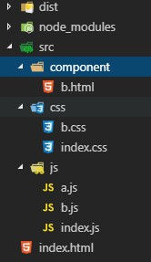
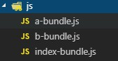

## webpack打包基本流程

### 一、项目的建立

#### 1.建立项目结构

项目机构如下：

```
webpack-demo
  |- dist
  |- /src
  	|- /css
  	  |- index.css
  	  |- b.css
  	|- /js
  	  |- index.js
  	  |- b.js
  	|- /component
  	  |- b.html
  |- index.html
  |- packge.json
  |- webpack.config.js
```

##### 01.先建立webpackDemo根文件夹

```先建立webpackDemo根文件夹，然后在初始化根文件夹
先建立webpackDemo根文件夹，然后在初始化根文件夹
npm init -y
初始化后就会得到packge.json文件，内容如下：
{
  "name": "webpackDemo",
  "version": "1.0.0",
  "description": "",
  "main": "index.js",
  "scripts": {
    "test": "echo \"Error: no test specified\" && exit 1",
  },
  "keywords": [],
  "author": "",
  "license": "ISC"
}
```

##### 02.再建立余下的文件



##### 03.安装webpack

```javascript
安装webpack，在根目录下打开git输入如下命令
npm i webpack --save-d
然后安装webpack-cli（webpack版本<4以下不必安装）
npm i webpack-cli --save-d
安装完后packge.json文件内容如下：
{
  "name": "webpackDemo",
  "version": "1.0.0",
  "description": "",
  "main": "index.js",
  "scripts": {
    "test": "echo \"Error: no test specified\" && exit 1",
  },
  "keywords": [],
  "author": "",
  "license": "ISC",
  "devDependencies": {
    "webpack": "^4.27.1",
    "webpack-cli": "^3.1.2"
  }
}
```

##### 04.配置webpack.config.js文件

```javascript
在根目录下建立webpack.config.js文件，配置
引入webpack
const webpack = require('webpack')
const path = require('path');

先配置入口，出口文件
module.exports = {
  //本项目为普通的多页面项目
  entry: {
    b：'./src/js/b/js',
    index: './src/index/js'
  },
  output: {
    filename: 'js/[name]-bundle.js',
    path: path.resolve(__dirname, 'dist')
  }
}

然后在运行'webpack'命令，就可以看到在dist里面生成了如下文件结构
```



```javascript
但是由于我们有多个js文件，所以进一步优化配置代码
先在头部引入glob，该组件可以异步读取文件
const glob = require("glob") 

//定义一个读取文件的函数
function getEntries(pattern){
  //glob可以异步读取文件
  var fileList = glob.sync(pattern);
  let obj = {};
  fileList.forEach(item => {
    let pathUrl = item.split('/')
    let key = pathUrl[pathUrl.length-1].split('.')[0]
    obj[key] = './'+item
  });
  return obj
}

//读取文件
const jsRegx = `src/js/*.js`
const jsEntries = getEntries(jsRegx)

然后entry配置代码可以改为
module.exports = {
  //本项目为普通的多页面项目
  entry: jsEntries,
  output: {
    filename: 'js/[name]-bundle.js',
    path: path.resolve(__dirname, 'dist')
  }
}
```

##### 05.配置html-wepback-plugin

```javascript
配置好该插件就可以把html文件打包进来dist文件家里面了

先安装html-webpack-plugin
npm i html-webpack-plugin --save-d

引入html-webpack-plugin
const htmlWebpackPlugin = require('html-webpack-plugin')

配置

const htmlRegx = `src/component/*.html`
const htmlEntries = getEntries(htmlRegx)

let htmlPlugins = []
for (key in htmlEntries){
  const config = {
    filename: './page/'+ key + '.html',
    template: htmlEntries[key],
    // inject: 'body',           //script标签的放置
    title: 'index title test',
    minify: {                    //html压缩
      removeComments: true,     //移除注释
      collapseWhitespace: true //移除空格
    },
    chunks: [],    
  }
  // 遍历判断注入每个页面对应的JS文件
  for (el in jsEntries){
    if (el === key) {
      config.chunks.push(key)
    }
  }
  htmlPlugins.push(new htmlWebpackPlugin(config))
}

module.exports = {
  //本项目为普通的多页面项目
  entry: jsEntries,
  output: {
    filename: 'js/[name]-bundle.js',
    path: path.resolve(__dirname, 'dist')
  },
  plugins:[
   //打包index.html文件
    new htmlWebpackPlugin({
      filename: 'index.html',
      template: 'index.html',
      // inject: 'body',           //script标签的放置
      title: 'index title test',
      minify: {                    //html压缩
        removeComments: true,     //移除注释
        collapseWhitespace: true //移除空格
      },
      chunks: ['index'],      //生成html页面后的script文件的引入
      //排除没有用到的script文件，其他的都引进来，比chunks更好匹配
      // excludeChunks: ['b']    //引入了main.js和aaa.js
    }),
    //打包component里的文件
    ...htmlPlugins
  ]
}
```

##### 06.配置各种loader

```javascript
安装js-loader
npm i js-loader --save-d
安装css-loader
npm i style-loader css-loader --save-d
安装sass-loader
npm install sass-loader node-sass webpack --save-dev
安装less的loader
npm i less less-lodaer --save-d
安装url的loader
npm i url-loader --save-d
安装图片的loader
npm i file-loader --save-dev

配置

module.exports = {
  rules:[
    // 解析ES6等新语法
    {
      test: /\.js$/,
      exclude: /node_modules/,  //我们在main.js入口中导入的第三方包, 不需要解析, 所以这里排除, 好处是提高打包效率
      loader: 'babel-loader'
    },
    //处理css中的loader
      {
        test: /\.css$/,
        // loader: ['style-loader', 'css-loader']
        use: [MiniCssExtractPlugin.loader, 'css-loader']
      },
      //处理sass中的loader
      {
        test: /\.scss$/,
        loader: ['style-loader', 'css-loader', 'sass-loader']
      },
      //处理less中的loader
      {
        test: /\.less$/,
        loader: ['style-loader', 'css-loader', 'less-loader']
      },
       //处理图片中的loader
      {
        test: /\.(jpg|png|jpeg|bmp|gif)$/,
        loader: ['url-loader?limit=1048576&name=./dist/images/[name].[ext][hash]'],
      },
      {
        test: /\.(ttf|woff|woff2|eot|svg)$/,
        loader: ['file-loader?name=./dist/fonts/[name].[ext][hash]']
      }
  ]
}
```

##### 07.配置独立打包css

```javascript
在相应的页面的js文件中引入css文件

比如在index.js文件中引入index.css
import '../src/css/index.css'

配置config文件
plugins:[
  //单独引入css
  new MiniCssExtractPlugin({
  filename: "css/[name].[contenthash].css",
  chunkFilename: "[name].[contenthash].css"
  })
]
```

完整的webpack.config.js配置如下：

```javascript
const path = require('path');
const htmlWebpackPlugin = require('html-webpack-plugin');
const MiniCssExtractPlugin = require('mini-css-extract-plugin');
const glob = require("glob") 

function getEntries(pattern){
  //glob可以异步读取文件
  var fileList = glob.sync(pattern);
  let obj = {};
  fileList.forEach(item => {
    let pathUrl = item.split('/')
    let key = pathUrl[pathUrl.length-1].split('.')[0]
    obj[key] = './'+item
  });
  return obj
}

const jsRegx = `src/js/*.js`
const htmlRegx = `src/component/*.html`
const jsEntries = getEntries(jsRegx)
const htmlEntries = getEntries(htmlRegx)

let htmlPlugins = []
for (key in htmlEntries){
  const config = {
    filename: './page/'+ key + '.html',
    template: htmlEntries[key],
    // inject: 'body',           //script标签的放置
    title: 'index title test',
    minify: {                    //html压缩
      removeComments: true,     //移除注释
      collapseWhitespace: true //移除空格
    },
    chunks: [],    
  }
  // 遍历判断注入每个页面对应的JS文件
  for (el in jsEntries){
    if (el === key) {
      config.chunks.push(key)
    }
  }
  htmlPlugins.push(new htmlWebpackPlugin(config))
}

module.exports = {
  mode: 'development', // 线上环境为production，开发环境则切换成 development
  // entry: {
  //   'index': './src/js/index.js',
  //   'a': './src/js/a.js',
  //   'b': './src/js/b.js'
  // },
  entry: jsEntries,
  output: {
    filename: 'js/[name]-bundle.js',
    path: path.resolve(__dirname, 'dist')
  },
  module:{
    rules:[
      //处理js中的loader
      {
        test: /\.js$/,
        loader: 'babel-loader',
        include: path.resolve(__dirname, '/src'),
        exclude: path.resolve(__dirname, '/node_modules')
      },
      //处理css中的loader
      {
        test: /\.css$/,
        // loader: ['style-loader', 'css-loader']
        use: [MiniCssExtractPlugin.loader, 'css-loader']
      },
      //处理sass中的loader
      {
        test: /\.scss$/,
        loader: ['style-loader', 'css-loader', 'sass-loader']
      },
      //处理less中的loader
      {
        test: /\.less$/,
        loader: ['style-loader', 'css-loader', 'less-loader']
      },
       //处理图片中的loader
      {
        test: /\.(jpg|png|jpeg|bmp|gif)$/,
        loader: ['url-loader?limit=1048576&name=./dist/images/[name].[ext][hash]'],
      },
      {
        test: /\.(ttf|woff|woff2|eot|svg)$/,
        loader: ['file-loader?name=./dist/fonts/[name].[ext][hash]']
      }
    ]   
  },
  plugins: [
    new htmlWebpackPlugin({
      filename: 'index.html',
      template: 'index.html',
      // inject: 'body',           //script标签的放置
      title: 'index title test',
      minify: {                    //html压缩
        removeComments: true,     //移除注释
        collapseWhitespace: true //移除空格
      },
      chunks: ['index'],      //生成html页面后的script文件的引入
      //排除没有用到的script文件，其他的都引进来，比chunks更好匹配
      // excludeChunks: ['b']    //引入了main.js和aaa.js
    }),

    // new htmlWebpackPlugin({
    //   filename: './page/b.html',
    //   template: './src/component/b.html',
    //   // inject: 'body',           //script标签的放置
    //   title: 'index title test',
    //   minify: {                    //html压缩
    //     removeComments: true,     //移除注释
    //     collapseWhitespace: true //移除空格
    //   },
    //   chunks: ['b'],      //生成html页面后的script文件的引入
    //   //排除没有用到的script文件，其他的都引进来，比chunks更好匹配
    //   // excludeChunks: ['b']    
    // }),

    ...htmlPlugins,

    //单独引入css
    new MiniCssExtractPlugin({
      filename: "css/[name].[contenthash].css",
      chunkFilename: "[name].[contenthash].css"
    })
  ]
};
```

##### 08.运行项目

```javascript
先安装webpack-dev-sever
npm i webpack-dev-server --save-d
配置packge.json
{
  "scripts": {
    "test": "echo \"Error: no test specified\" && exit 1",
    "dev": "webpack-dev-server --inline --hot --open --port 8585",
    "build": "webpack" //打包命令
  },
}

然后在运行npm run dev命令就可以运行整个项目了
```

